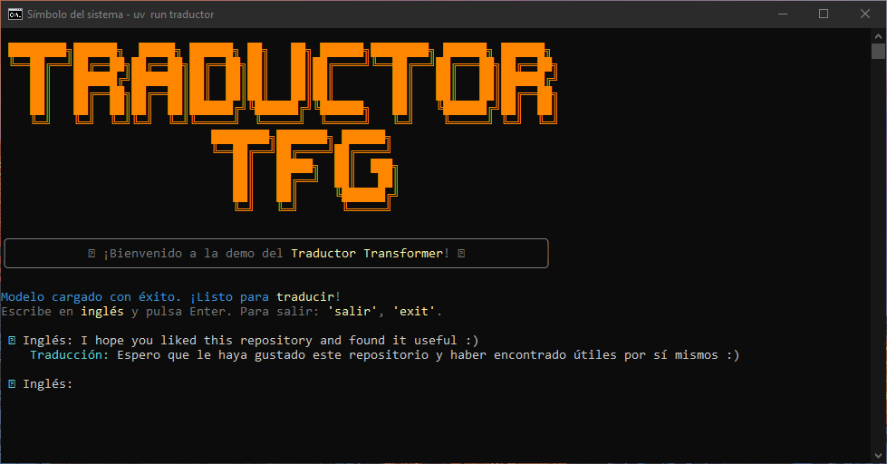

# Transformer: English to Spanish Translator from Scratch

[Español](README.es.md) | **English**

[Paper](https://arxiv.org/abs/1706.03762) | [PyTorch](https://pytorch.org/) | [License: MIT](https://opensource.org/licenses/MIT)

This repository contains the complete implementation, from scratch, of a Transformer model based on the Encoder-Decoder architecture described in the original paper "Attention Is All You Need" (Vaswani et al., 2017).

The main goal of this project is to train a Neural Machine Translation (NMT) model capable of translating text from English to Spanish.

---

## Index
1. [About this project](#about-this-project)
2. [Architecture and Configuration](#architecture-and-configuration)
3. [Training Datasets](#training-datasets)
4. [Tokenization and Custom Vocabulary (BPE)](#tokenization-and-custom-vocabulary-bpe)
5. [CLI: Installation and Usage](#cli)

---

## About this project

This repository is the practical implementation of my **Mathematics Final Degree Project (TFG)**.

> **Note:** While the written report of the TFG analyzes and explains in detail the theory and all the mathematical concepts underlying this architecture, this project is the result of putting that knowledge into practice.

For this reason, **no high-level NLP libraries** (such as *Hugging Face*) have been used. Instead, the model has been programmed from scratch, component by component (Self-Attention, Multi-Head Attention, Positional Encoding, etc.) using **PyTorch**. The objective of this approach is to deeply understand the matrix operations, internal behavior, and the flow of tensors that make the Transformer work correctly.

### What is a Transformer?
Before 2017, machine translation was dominated by Recurrent Neural Networks (RNNs) and LSTMs, which processed text word by word, being slow and losing context in long sentences.

The **Transformer** revolutionized Artificial Intelligence by eliminating recurrence and using only **Attention Mechanisms** (*Self-Attention* and *Cross-Attention*). This allows the model to achieve:
1. **Parallelization:** Process all words in a sentence simultaneously.
2. **Global Context:** Understand how words in a sentence are related to each other, regardless of the distance between them.

---

## Architecture and Configuration

The project replicates the classic **Encoder-Decoder** architecture. The Encoder processes the English sentence and extracts its deep meaning, while the Decoder takes that information and generates the Spanish translation, paying attention to relevant parts of the original text step by step.

<p align="center">
  
  <br>
  <em>Original Transformer Architecture (Vaswani et al., 2017)</em>
</p>

### Model Parameters
For this training, the model has been instantiated with the following technical configuration:

| Parameter | Value | Description |
| :--- | :--- | :--- |
| `CONTEXT_LENGTH` | **128** | Maximum length of input and output sequences (in tokens). |
| `D_EMBEDDING` | **256** | Dimension of embedding vectors and hidden layers. |
| `ATTENTION_HEADS`| **8** | Number of "heads" in the Multi-Head Attention mechanism. |
| `NUMBER_ENCODERS`| **4** | Number of stacked layers in the Encoder block. |
| `NUMBER_DECODERS`| **4** | Number of stacked layers in the Decoder block. |
| `DROPOUT` | **0.1** | Dropout rate used for regularization. |

---

## Training Datasets
The **OPUS-100** dataset was used for training the model for the English-Spanish language pair.

Data filtering was performed to improve the quality of the corpus, and a detailed analysis of this process can be found in the `dataset.ipynb` notebook.

---

## Tokenization and Custom Vocabulary (BPE)

Instead of relying on generic pre-trained tokenizers (such as OpenAI's `cl100k_base` or GPT-2's), this project implements **its own tokenizer trained from scratch** on our bilingual corpus. This significantly improves the algorithm's learning as it is specifically adapted to English and Spanish.

**Tokenizer Features:**
* **Algorithm:** Byte-Pair Encoding (BPE) at the byte level (`ByteLevel`).
* **Vocabulary Size:** 16,000 tokens (shared vocabulary for both languages).
* **Special Tokens:** * `<PAD>`: To pad short sequences.
    * `<START>`: Indicates the start of the translation.
    * `<END>`: Indicates the end of the generated sequence.
    * `<UNK>`: For out-of-vocabulary words.

Having a specific vocabulary for the English-Spanish pair optimizes the embedding space. This not only facilitates Transformer learning but also provides a much more robust generalization for unseen texts.

---

## CLI

A flow has been created to interact with the trained model directly through the console.

### 1. Installation of uv

To manage the environment and dependencies efficiently, it is necessary to install **[uv](https://github.com/astral-sh/uv)**. Use the command corresponding to your operating system:

**macOS and Linux:**
```bash
# On macOS and Linux.
curl -LsSf https://astral.sh/uv/install.sh | sh
```

**Windows:**
```powershell
#Windows.
powershell -ExecutionPolicy ByPass -c "irm https://astral.sh/uv/install.ps1 | iex"
```

### 2. Project Configuration

Once `uv` is installed, follow these steps to configure the repository:

1. **Clone the repository and change the path:**
   ```bash
   git clone https://github.com/skaczylo/Transformer-Translator.git
   cd TranslatorEn2Es
   ```

2. **Synchronize the environment:**
   This command will automatically install the necessary Python version and all dependencies:
   ```bash
   uv sync
   ```

### 3. Run the translator

To start the interactive interface in the terminal and begin translating, run the command. This will automatically download the model weights from Google Drive.

```bash
uv run traductor
```
<p align="center">
  
  <br>
  <em>CLI</em>
</p>